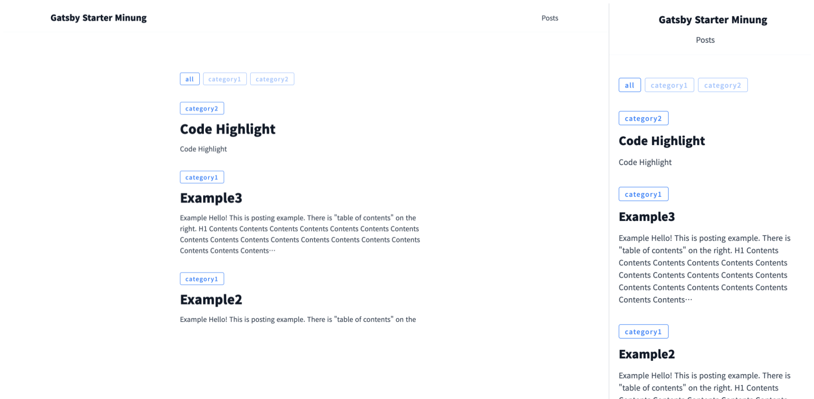

## gatsby-starter-minung

[](https://app.netlify.com/sites/gatsby-starter-minung/deploys)

[한국어](./README.KR.md)



## Features

- Tailwindcss based theme
- Category
- Code Highlighting
- TOC
- Comments based on Utterances
- Google Analytics

## Getting Started

Use the Gatsby CLI to create a new site, specifying the `gatsby-starter-minung`.

```bash
$ npx gatsby new my-blog https://github.com/hmu332233/gatsby-starter-minung
$ cd my-blog
$ npm start
```

## Add Post

To add posts, just add a `.md` file to `/posts`  
It is good to refer to file [template.md](https://github.com/hmu332233/gatsby-starter-minung/blob/main/posts/example.md).


## Deploy

Use [netilfy](https://www.netlify.com/) or [vercel](https://vercel.com/) to simplify deployment.

## LICENSE

MIT
